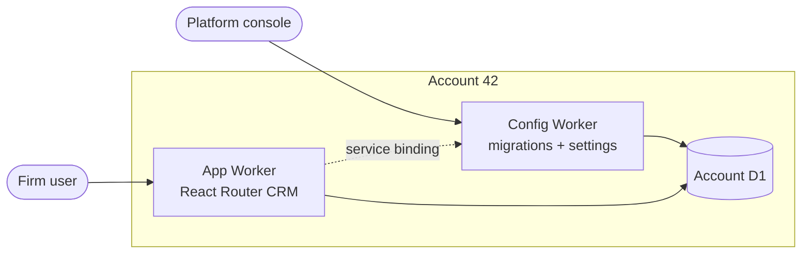
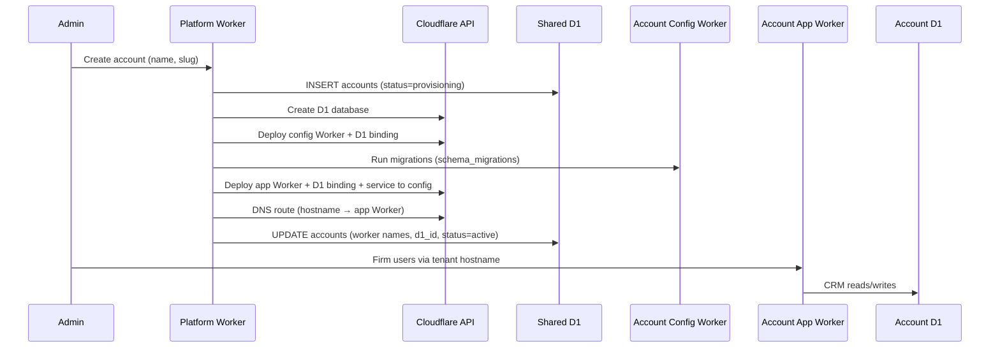

# ADR 0001: One D1 database per customer (account)

| | |
|---|---|
| **Status** | Accepted |
| **Date** | 2026-06-02 |
| **Deciders** | Platform / data architecture |

## Context

Typeed Forms is multi-tenant SaaS on Cloudflare. Each **account** is a customer firm (tenant). We must support:

- Up to ~4,000 concurrent UK users **per account**
- ~5 GB of data **per account** over ~10 years (document-centric client management)
- **Strong tenant isolation** and UK/EU data residency (GDPR)
- Compliance-sensitive financial / advice data
- **Test and training environments** — many firms need sandbox or training stacks separate from live client data
- **Network restrictions** — some firms require access only from known IPs (e.g. corporate VPN egress ranges)

We considered storing all customer data in a single shared D1 with `account_id` filtering. We rejected that for customer domains and instead isolate each account at the **database and Worker** boundary.

Cloudflare Workers have a **compressed bundle size limit** (order of single-digit MB per script). The CRM app (React Router SSR, routes, UI) is large. Splitting each account into **two Workers** — **config** and **app** — keeps the user-facing bundle small and moves migrations / account settings into a separate minimal script.

Platform registry data (`accounts`, `providers`) remains in a **Shared D1** with a single platform Worker. See [db-diagrams.md](../skills/db-setup/db-diagrams.md).

## Decision

**Each customer account gets its own Account D1 and two account Workers** — **config** and **app** — both bound only to that D1.

- **Shared D1** — `accounts`, `providers` (all tenants; routing metadata only).
- **Account D1** — `users`, `groups`, `clients`, cases, documents, contacts, etc. (one database per account; never shared).
- **Account Config Worker** — small bundle: schema migrations, account settings API, internal/platform hooks. No React.
- **Account App Worker** — CRM bundle: React Router SSR, loaders/actions, UI. No migration runner.

Tenant isolation is enforced by **which D1 the Workers are bound to**, not by `WHERE account_id = ?` on shared tables. `account_id` inside JSON (`TrackingSchema`) remains for audit and consistent schemas; it must not be relied on for isolation.

```
Platform
├── Shared Worker → Shared D1 (accounts, providers)
└── Per account
    ├── Account A Config Worker ──┐
    ├── Account A App Worker    ├──► Account A D1
    ├── Account B Config Worker ──┤
    ├── Account B App Worker    ├──► Account B D1
    └── …
```

### Config vs app Worker

| | **Config Worker** | **App Worker** |
|---|-------------------|----------------|
| **Script name** | `acct-{id}-{slug}-config` | `acct-{id}-{slug}-app` |
| **Bundle** | Migrations, D1 helpers, JSON config routes | React Router CRM only |
| **Public route** | Optional: `/api/config/*`, `/internal/*` only | **Yes** — tenant hostname `/*` |
| **D1 binding** | `ACCOUNT_DB` (migrations, config reads) | `ACCOUNT_DB` (all CRM data) |
| **R2** | Usually no | Yes (documents) |
| **Invoked by** | Platform on provision; deploy hook; app via service binding | End users (browser) |

**Request path (typical):**

```text
Browser → WAF → hostname route → App Worker → Account D1
                                      │
                                      └─ (optional) service binding → Config Worker
                                          e.g. GET /api/config/features
```

Deploy **config Worker first**, run migrations, then deploy **app Worker**. Both share the same `ACCOUNT_DB` binding to the account’s D1.



## Consequences — benefits

| Benefit | Why it matters |
|---------|----------------|
| **Hard isolation** | No cross-tenant rows in customer tables; blast radius of bad queries or bugs is one account. |
| **Compliance narrative** | Easier to explain “this firm’s data lives in its own database” to auditors and customers. |
| **Independent scale shape** | Hot accounts do not contend on the same SQLite file as cold accounts (within Cloudflare D1 limits). |
| **Per-account lifecycle** | Export, freeze, or delete an account by operating on one D1 (+ Worker + R2 prefix) without touching others. |
| **Schema freedom per tier** | Shared D1 can stay relational for registry rows; Account D1 uses the JSON `body` + generated column pattern (see [d1-sql-json-body.mdc](../../../.cursor/rules/d1-sql-json-body.mdc)). |
| **Deploy coupling** | Config Worker runs migrations on deploy; app Worker deploy assumes schema is current. |
| **Smaller app bundle** | Migrations and config logic are not shipped in the React Router Worker — stays under Cloudflare size limits and cold-start cost. |

## Consequences — costs (especially maintainability)

| Cost | Mitigation |
|------|------------|
| **N databases, 2N Workers** | Automate provisioning (below); never hand-provision. Store `db_shard_id`, both Worker names, and D1 UUID on the shared `accounts` row. |
| **Schema drift across accounts** | Single migration source in repo; `schema_migrations` table in **every** Account D1; run pending migrations on Worker startup (or deploy hook) per binding. |
| **Operational visibility** | Tag D1/Worker names with `account_id` / slug; central logging with `account_id`; optional nightly job to compare `schema_migrations` version across accounts. |
| **Deploy fan-out** | Two deploy steps per account (config then app); same **code artifacts** for all accounts — only bindings and script names differ. |
| **Config/app coupling** | Version config and app artifacts together in CI (same git tag); app Worker documents minimum `schema_version` it expects; config Worker owns `LATEST_SCHEMA_VERSION`. |
| **Local dev complexity** | `wrangler.jsonc` keeps one example `CUST_DB1` binding; integration tests use a single test Account D1. |
| **Cost surface** | Accept 2× Worker scripts per account vs one mega-Worker; monitor per-account storage; archive inactive accounts. |
| **Cross-account reporting** | Platform analytics read from Shared D1 or async export pipelines — never join Account D1s at query time in the app path. |
| **Test / training stacks** | Same provisioning pipeline with `account_kind`; clear naming; optional expiry; never copy production D1 into training without explicit scrubbed export. |

## Test and training accounts

Many customers need **non-production** environments for UAT, adviser training, or demos. These are still **one Account D1 + two Workers (config + app) each** — same isolation model as production, not a shared “sandbox D1” mixed with live firms.

### Account kinds (Shared D1 registry)

Extend the `accounts` row with an explicit kind (names illustrative):

| `account_kind` | Purpose | Typical hostname |
|----------------|---------|------------------|
| `production` | Live firm data | `example-financial.app.typeedforms.co.uk` |
| `training` | Courses, dummy clients, resettable data | `example-financial-training.app.typeedforms.co.uk` |
| `test` | Customer UAT before go-live | `example-financial-uat.app.typeedforms.co.uk` |

Optional fields: `parent_account_id` (links training/UAT to the production account), `expires_at` (auto-archive training stacks), `allows_real_pii` (default `false` for training/test).

### Provisioning

Use the **same steps** as production (D1 + config Worker + app Worker + migrations + route). Only naming and metadata differ:

```
Config Worker: acct-42-example-financial-config
App Worker:    acct-42-example-financial-app
D1:            acct-42-example-financial-db
Hostname:      example-financial.app.typeedforms.co.uk  →  app Worker
```

```sql
-- Shared D1 — training stack for production account 42
INSERT INTO accounts (name, slug, account_kind, parent_account_id, status, created_at)
VALUES (
  'Example Financial (Training)',
  'example-financial-training',
  'training',
  42,
  'provisioning',
  datetime('now')
);
```

### Rules

- **No shared Account D1** between production and training — training deletes/resets must not touch live data.
- **Seed data** — optional platform template (synthetic clients) applied at create; never auto-clone production without a governed export + anonymisation job.
- **Auth** — same app login model; users are provisioned only on the training hostname (or flagged in `users` for that stack’s D1).
- **Billing / limits** — training/test rows flagged so metering and support SLAs differ from production.

## Network access (VPN / IP allowlist)

Some customers require that **only traffic from their corporate network** (VPN egress IPs) can reach the app. This is independent of the one-D1-per-account decision: it is enforced at the **edge** (hostname + Cloudflare), not inside D1.

### Per-account Workers (chosen model)

Each firm’s hostname routes to the **app Worker**. WAF rules apply on that hostname (or scoped with `http.host eq "…"`).

```text
User (on VPN) → corporate egress IP → Cloudflare WAF (allow if IP in list) → App Worker → Account D1
User (off VPN) → block (403) before Worker runs
```

Example WAF custom rule (zone-level; host-scoped):

```txt
(
  http.host eq "example-financial.app.typeedforms.co.uk"
  and not ip.src in $example_financial_allowed_ips
)
→ Block
```

Maintain `$example_financial_allowed_ips` as a Cloudflare **IP list** (firm VPN ranges + any break-glass ops IPs). Update via API when the customer changes provider or adds a region.

### Single Worker alternative (not chosen, but compatible)

If we used **one Worker** serving many accounts (routing by host or `account_id`), IP restriction still works the same way:

- Map **each tenant hostname** (or path prefix) on a zone you control.
- Attach WAF rules per hostname, or one rule with multiple `http.host in { … }` clauses and matching IP lists.
- Do **not** rely on `*.workers.dev` for IP filtering — WAF does not apply there. Set `workers_dev = false` and use only zone/custom domains.

Worker-level check (defence in depth only — prefer WAF first):

```ts
const ALLOWED = new Set(env.ALLOWED_EGRESS_CIDRS?.split(",") ?? []);
const ip = request.headers.get("CF-Connecting-IP");
if (ALLOWED.size > 0 && ip && !cidrContains(ALLOWED, ip)) {
  return new Response("Forbidden", { status: 403 });
}
```

Store allowlists in env per account app Worker, or centrally in KV — but **WAF should be the primary gate** so unwanted traffic never executes Worker code.

### VPN nuance

- Allowlist **egress IPs** the VPN presents to the internet, not “VPN” as a protocol. Customers must supply CIDRs; document that split-tunnel users may bypass the VPN unless policy forces full tunnel.
- **Mobile / home working** — either extend the IP list, use Cloudflare Access (identity + device posture) instead of IP-only, or a hybrid: WAF IP allowlist for office + Access for remote staff.

### Cloudflare Access (optional upgrade)

For stricter control than IP lists alone, put the hostname behind [Cloudflare Access](https://developers.cloudflare.com/cloudflare-one/policies/access/) (IdP, MFA, device posture). Combines well with per-account hostnames; IP allowlist can remain as an extra layer for production-only tenants.

## Account provisioning (high level)

Triggered when a new firm is onboarded (platform Worker or admin job). Order matters: create registry row → infrastructure → migrations → mark active.



### 1. Register the account (Shared D1)

Insert a row in `accounts` with `status = provisioning` and a stable slug used in resource names.

```sql
-- Shared D1
INSERT INTO accounts (name, slug, status, created_at)
VALUES ('Example Financial Ltd', 'example-financial', 'provisioning', datetime('now'));
-- application assigns id = 42
```

### 2. Create Account D1 (Cloudflare API)

Naming convention: `acct-{account_id}-{slug}-db` (globally unique, grep-friendly in dashboard).

```bash
ACCOUNT_ID="<cloudflare_account_id>"
API_TOKEN="<token_with_d1_edit>"

curl -sS -X POST \
  "https://api.cloudflare.com/client/v4/accounts/${ACCOUNT_ID}/d1/database" \
  -H "Authorization: Bearer ${API_TOKEN}" \
  -H "Content-Type: application/json" \
  --data '{"name":"acct-42-example-financial-db"}' \
  | jq '.result.uuid, .result.name'
# → d1_database_id e.g. "a1b2c3d4-..."
```

### 3. Deploy account Config Worker (migrations + settings)

Small bundle — **no React**. Runs migrations and exposes internal/config routes.

**Option A — Wrangler (CI / scripted per account)**

`wrangler.acct-42-config.jsonc` (generated):

```jsonc
{
  "name": "acct-42-example-financial-config",
  "main": "./workers/account-config.ts",
  "compatibility_date": "2025-04-04",
  "workers_dev": false,
  "d1_databases": [
    {
      "binding": "ACCOUNT_DB",
      "database_name": "acct-42-example-financial-db",
      "database_id": "a1b2c3d4-e5f6-7890-abcd-ef1234567890"
    }
  ],
  "vars": {
    "ACCOUNT_ID": "42",
    "ACCOUNT_SLUG": "example-financial"
  }
}
```

```bash
pnpm wrangler deploy --config wrangler.acct-42-config.jsonc
# Config Worker runs ensureSchema() on startup or via POST /internal/migrate
```

### 4. Deploy account App Worker (CRM)

React Router bundle only — **no migration SQL bundled**.

`wrangler.acct-42-app.jsonc` (generated):

```jsonc
{
  "name": "acct-42-example-financial-app",
  "main": "./workers/app.ts",
  "compatibility_date": "2025-04-04",
  "workers_dev": false,
  "d1_databases": [
    {
      "binding": "ACCOUNT_DB",
      "database_name": "acct-42-example-financial-db",
      "database_id": "a1b2c3d4-e5f6-7890-abcd-ef1234567890"
    }
  ],
  "services": [
    {
      "binding": "ACCOUNT_CONFIG",
      "service": "acct-42-example-financial-config"
    }
  ],
  "vars": {
    "ACCOUNT_ID": "42",
    "ACCOUNT_SLUG": "example-financial"
  }
}
```

```bash
pnpm wrangler deploy --config wrangler.acct-42-app.jsonc
```

**Option B — Workers Scripts API** (orchestrator owns JSON)

Upload both scripts. Config gets `ACCOUNT_DB`; app gets `ACCOUNT_DB` + service binding to config. Store both script names on the `accounts` row.

**Deploy order:** config → migrate → app. Never deploy app before migrations succeed.

### 5. DNS / hostname → App Worker

Route the firm’s hostname to the **app Worker** only (not config). Config is reached via service binding or optional narrow route patterns.

```bash
ZONE_ID="<zone_id>"

# Subdomain: example-financial.app.typeedforms.co.uk → app Worker
curl -sS -X POST \
  "https://api.cloudflare.com/client/v4/zones/${ZONE_ID}/workers/routes" \
  -H "Authorization: Bearer ${API_TOKEN}" \
  -H "Content-Type: application/json" \
  --data '{
    "pattern": "example-financial.app.typeedforms.co.uk/*",
    "script": "acct-42-example-financial-app"
  }'
```

Optional second route for config API (if not using service binding only):

```json
{
  "pattern": "example-financial.app.typeedforms.co.uk/api/config/*",
  "script": "acct-42-example-financial-config"
}
```

For custom domains, attach the custom domain to the **app Worker**. Keep config off the public internet except via service binding or `/api/config/*`.

### 6. Persist routing metadata (Shared D1)

Update the registry row so sessions can reach the correct stack (`UserSession.db_shard_id`).

```sql
UPDATE accounts
SET
  db_shard_id = 'acct-42-example-financial',
  d1_database_id = 'a1b2c3d4-e5f6-7890-abcd-ef1234567890',
  config_worker_name = 'acct-42-example-financial-config',
  app_worker_name = 'acct-42-example-financial-app',
  hostname = 'example-financial.app.typeedforms.co.uk',
  status = 'active',
  updated_at = datetime('now')
WHERE id = 42;
```

Authenticated requests: users hit **app Worker** on `hostname`. Platform provisioning and migration jobs call **config Worker** (service binding from platform Worker or Cloudflare API). Both Workers only ever see `env.ACCOUNT_DB` for that firm.

## Schema migrations (per Account D1)

### Two different “versions”

| Name | Scope | Purpose |
|------|--------|---------|
| **`schema_migrations`** | Database (DDL) | Tracks which SQL migration files have been applied to **this** D1 |
| **`body.version`** (`TrackingSchema`) | Row (JSON) | Optimistic concurrency on entity updates — unrelated to DDL |

Do not conflate them.

### Migration table (every Account D1)

Created by migration `0000_init.sql`:

```sql
CREATE TABLE IF NOT EXISTS schema_migrations (
  version INTEGER PRIMARY KEY,
  name TEXT NOT NULL UNIQUE,
  applied_at TEXT NOT NULL DEFAULT (datetime('now'))
);
```

Example later migration file: `migrations/account/0001_clients.sql`

```sql
-- depends: 0000_init
CREATE TABLE IF NOT EXISTS clients (
  id INTEGER PRIMARY KEY AUTOINCREMENT,
  body TEXT NOT NULL,
  client_type TEXT GENERATED ALWAYS AS (json_extract(body, '$.client_type')) STORED,
  is_deleted INTEGER GENERATED ALWAYS AS (json_extract(body, '$.is_deleted')) STORED
);
CREATE INDEX IF NOT EXISTS idx_clients_deleted ON clients(is_deleted);

INSERT INTO schema_migrations (version, name) VALUES (1, '0001_clients');
```

### When migrations run

1. **Account create** — after D1 exists, **config Worker** deploy applies all migrations from version `0` → `latest`.
2. **Config Worker deploy** — on startup or `/internal/migrate`, compare `MAX(schema_migrations.version)` to bundled `LATEST_SCHEMA_VERSION`; apply pending files in order.
3. **App Worker deploy** — does **not** run migrations; fails health check if config reports schema below required version.
4. **Shared D1** — separate `schema_migrations` (or Wrangler `migrations` folder) for `accounts` / `providers` only; never run account DDL against Shared D1.

Pseudo-code (**config Worker** only):

```ts
const LATEST = 3; // matches highest migrations/account/00NN_*.sql

async function ensureSchema(db: D1Database) {
  await db.exec(`CREATE TABLE IF NOT EXISTS schema_migrations (
    version INTEGER PRIMARY KEY,
    name TEXT NOT NULL UNIQUE,
    applied_at TEXT NOT NULL DEFAULT (datetime('now'))
  )`);

  const row = await db
    .prepare("SELECT COALESCE(MAX(version), 0) AS v FROM schema_migrations")
    .first<{ v: number }>();
  const current = row?.v ?? 0;

  for (let v = current + 1; v <= LATEST; v++) {
    const sql = MIGRATIONS[v]; // bundled strings from repo
    await db.batch([
      db.prepare(sql),
      db.prepare("INSERT INTO schema_migrations (version, name) VALUES (?, ?)").bind(
        v,
        `000${v}_...`
      ),
    ]);
  }
}
```

**Rules**

- Migrations are **forward-only** and **idempotent** where possible (`IF NOT EXISTS`).
- One migration file = one monotonic `version` integer.
- Never skip versions on a given D1.
- Failed migration leaves account in `provisioning` or `migration_failed` until repaired (platform dashboard + alert).

### Wrangler local / CI

```bash
# Apply to a specific remote Account D1 (example)
pnpm wrangler d1 execute acct-42-example-financial-db \
  --remote \
  --file=./migrations/account/0001_clients.sql
```

Prefer the **config Worker** runner for production so migration SQL never ships in the app bundle. Platform CI can also `wrangler d1 execute` as a fallback.

## What lives where (reference)

| Data | Database | Worker |
|------|----------|--------|
| Account registry, provider marketplace | Shared D1 | Platform Worker |
| Users, groups, clients, cases, documents, contacts | Account D1 | App Worker (user traffic) |
| Schema migrations, account feature config | Account D1 | Config Worker |
| File bytes | R2 (per-account bucket or prefix) | App Worker |

Full table trees: [db-diagrams.md](../skills/db-setup/db-diagrams.md).

## Alternatives considered

| Alternative | Why not |
|-------------|---------|
| Single shared D1 for all customer data | Weaker isolation; every query must enforce `account_id`; higher compliance and bug blast radius. |
| One Worker per account (config + app combined) | CRM + migration SQL exceeds practical Worker bundle limits; slower cold starts. |
| One Worker, many D1 bindings | Possible, but binding surface and routing logic grow complex; per-account Workers match isolation story. IP allowlisting still works via per-host WAF rules on a shared zone. |
| Shared “training D1” for all firms | Rejected — breaks isolation; training must be provisioned like production with `account_kind = training`. |
| Durable Objects per tenant | Not required for this workload; D1 + per-account Workers is simpler for document-centric CRUD. |

## Follow-up work

- [ ] Split repo: `workers/account-config.ts` (migrations) vs `workers/app.ts` (CRM)
- [ ] Implement platform provisioning job (deploy config → migrate → deploy app)
- [ ] Add `migrations/account/` and `migrations/shared/` directories with `schema_migrations`
- [ ] Remove `accounts` from account `TableName` union in `db-utils.ts` once split is complete
- [ ] Add `config_worker_name`, `app_worker_name` to `AccountSchema` / shared `accounts` DDL (alongside `db_shard_id`)
- [ ] Add `account_kind`, `parent_account_id`, `expires_at` to `AccountSchema` / shared `accounts` DDL
- [ ] Document customer VPN CIDR onboarding and WAF IP list update runbook
- [ ] Optional: Cloudflare Access policy template per account hostname

## References

- [README.md](../../README.md)
- [db-tables.md](../skills/db-setup/db-tables.md)
- [db-diagrams.md](../skills/db-setup/db-diagrams.md)
- [Cloudflare D1 — Create database](https://developers.cloudflare.com/api/resources/d1/subresources/database/methods/create/)
- [Cloudflare Workers — Service bindings](https://developers.cloudflare.com/workers/runtime-apis/bindings/service-bindings/)
- [Cloudflare Workers — Limits (bundle size)](https://developers.cloudflare.com/workers/platform/limits/)
- [Cloudflare Workers — Routes](https://developers.cloudflare.com/workers/configuration/routing/routes/)
- [WAF — Allow traffic from IP allowlist only](https://developers.cloudflare.com/waf/custom-rules/use-cases/allow-traffic-from-ips-in-allowlist/)
- [Cloudflare Access](https://developers.cloudflare.com/cloudflare-one/policies/access/)
