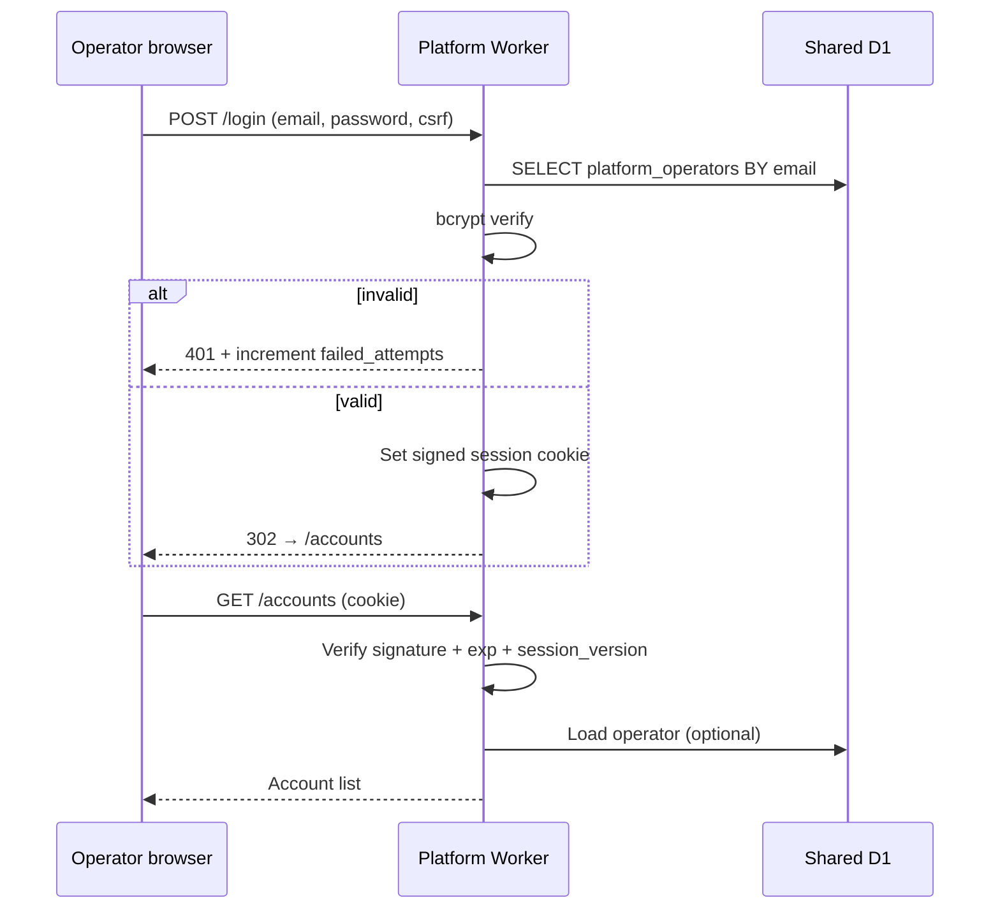

# Platform app — internal account console

Internal web app for **typeed-forms operators** (engineering, support, onboarding). Not used by customer firms or their advisers.

| | |
|---|---|
| **Audience** | Internal staff only |
| **Stack** | **React Router v7** (Remix-style full-stack) on **Cloudflare Workers** — same pattern as the CRM app; “Remix v3” here means framework-mode routes, loaders/actions, and SSR on Workers, not a separate Remix package |
| **Data** | **Shared D1** (`accounts`, `providers`, platform operators). Customer data stays in **Account D1**; this app does not query client/case tables directly except via controlled account APIs |
| **Related** | [ADR 0001 — one D1 per account](../adr/0001-one-d1-database-per-account.md), [db-tables.md](../skills/db-setup/db-tables.md), [navigation.md](./navigation.md) (customer CRM — separate app) |

---

## Goals

| Goal | Detail |
|------|--------|
| **Account registry** | List, search, and inspect accounts (`production` / `training` / `test`) |
| **Create account** | Insert shared `accounts` row and run provisioning (D1 + Worker + DNS + migrations) per ADR |
| **Lifecycle** | View status (`provisioning`, `active`, `suspended`, `migration_failed`), retry failed steps, deactivate |
| **Operators (phase 1)** | Sign in, sign out, change password; manage who can use the console |
| **Account users (phase 2)** | Optional: list or create **bootstrap** users in an account’s D1 (e.g. first firm admin) via account Worker API — not full CRM user admin |

Non-goals for v1: billing, analytics dashboards, editing client/case data, marketplace provider CMS (can follow later).

---

## Deployment shape

Separate hostname and Worker from the customer CRM and from per-account Workers.

```
platform.internal.typeedforms.co.uk  →  Platform Worker  →  Shared D1 (ACCOUNTS_DB)
example-financial.app…               →  Account Worker     →  Account D1 only
```

| Binding | Platform Worker | Account Worker |
|---------|-----------------|----------------|
| `ACCOUNTS_DB` | Yes | No |
| `ACCOUNT_DB` | No | Yes (one per deploy) |
| Cloudflare API token (provisioning) | Yes (secret) | No |

Recommended repo layout (when implemented):

```text
platform-app/          # or packages/platform — separate wrangler project
  app/routes/
  workers/app.ts
  wrangler.jsonc       # name: typeed-platform, d1: ACCOUNTS_DB only
```

Customer CRM remains `my-react-router-app/` (or renames to `crm-app/` later). Shared types (`AccountSchema`) can live in a small shared package.

---

## Authentication (no third-party IdP)

**Requirement:** no external identity providers (no Google, Microsoft Entra, Auth0, Clerk, etc.). Authentication is **first-party**: credentials and sessions owned entirely by the platform Worker and Shared D1.

### Identity model

| Store | Who | Where |
|-------|-----|--------|
| `platform_operators` | Internal staff who use this console | **Shared D1 only** |
| `users` + `login_detail` | Firm advisers/staff | **Account D1** per [user.ts](../../app/models/admin/user.ts) — CRM login, not platform login |

Do **not** reuse account `users` for platform sign-in. Mixing roles complicates audit and violates least privilege.

### Recommended approach: email + password + signed session cookie

| Layer | Choice | Rationale |
|-------|--------|-----------|
| **Password hash** | **bcrypt** (cost 12+) | Already documented for account `login_detail.password`; one library/strategy across the monorepo |
| **Session** | **HttpOnly, Secure, `SameSite=Strict` cookie** | Standard for Workers; no localStorage tokens |
| **Session payload** | **Signed, opaque cookie** (HMAC-SHA256 via Web Crypto + `PLATFORM_SESSION_SECRET`) | No server-side session store required for v1; include `operator_id`, `session_version`, `exp` |
| **Revocation** | Bump `session_version` on `platform_operators` row (password change, disable user) | Invalidates all prior cookies without a session table |
| **CSRF** | React Router **action** posts + CSRF token in session or double-submit cookie | Required for mutating routes |
| **Login hardening** | Rate limit by IP + email; lockout after N failures (mirror `login_failed_attempts` on account users) | Mitigate brute force on a small operator set |

Optional later (still no third party):

| Enhancement | Mechanism |
|-------------|-----------|
| **TOTP MFA** | `otpauth` secret per operator in Shared D1; verify in login action (library e.g. `otpauth` / RFC 6238) |
| **Session table** | `platform_sessions` in Shared D1 if you need per-device revoke lists |
| **Passkeys** | WebAuthn stored in Shared D1 — more work; good phase 3 |

### What we explicitly avoid

| Approach | Why |
|----------|-----|
| OAuth / SAML / social login | Third-party involvement; not required for a tiny internal user base |
| JWT in `Authorization` header for browser UI | Harder to secure in browsers than HttpOnly cookies; fine for machine APIs later |
| Shared password with CRM | Different apps, different threat model |
| Cloudflare Access as **primary** login | Optional **network** layer only (see below); operators should still authenticate to the app |

### Network layer (defence in depth)

Align with [ADR 0001 — network access](../adr/0001-one-d1-database-per-account.md):

- Hostname `platform.internal…` on a zone you control.
- **WAF IP allowlist** (office VPN egress CIDRs) so the console is not on the public internet even before login.
- `workers_dev = false`; no `*.workers.dev` URL for this app.

Auth + IP restrict is appropriate for internal tools.

### Bootstrap (first operator)

No self-registration on the public internet.

1. **One-time CLI** (or Wrangler `d1 execute`) inserts the first `platform_operators` row with a bcrypt hash.
2. Or set `PLATFORM_BOOTSTRAP_EMAIL` + `PLATFORM_BOOTSTRAP_PASSWORD_HASH` as secrets consumed only on first deploy if table is empty (then remove secret).

Subsequent operators are created by an existing `admin` operator inside the app.

### Login / session flow



### Authorization (roles)

| Role | Permissions |
|------|-------------|
| `viewer` | List/read accounts, view provisioning status |
| `operator` | Create account, retry provisioning, create training/UAT stacks |
| `admin` | Manage `platform_operators`, suspend accounts, break-glass actions |

Enforce in **loaders/actions** (return 403) and hide UI controls — not client-only checks.

---

## Data model (Shared D1)

### `platform_operators` (new)

| Column | Type | Notes |
|--------|------|--------|
| `id` | INTEGER PK | |
| `email` | TEXT UNIQUE | Login identifier |
| `display_name` | TEXT | |
| `password_hash` | TEXT | bcrypt |
| `role` | TEXT | `viewer` \| `operator` \| `admin` |
| `is_active` | INTEGER | 0/1 |
| `session_version` | INTEGER | Increment to revoke sessions |
| `totp_secret_enc` | TEXT NULL | Optional MFA |
| `login_failed_attempts` | INTEGER | |
| `locked_until` | TEXT NULL | ISO datetime |
| `created_at` / `updated_at` | TEXT | |

### `accounts` (existing registry — extend per ADR)

Platform app reads/writes registry fields; provisioning job updates `status`, `db_shard_id`, `d1_database_id`, `hostname`, `account_kind`, `parent_account_id`, etc. See [AccountSchema](../../app/models/admin/account.ts) and ADR 0001.

### `platform_audit_log` (recommended)

Append-only: `operator_id`, `action`, `account_id`, `payload_json`, `created_at`. Use for create account, suspend, reprovision, operator CRUD.

---

## Routes (v1)

URLs kebab-case. All routes below require authenticated session except `/login`.

| Method | URL | Purpose |
|--------|-----|---------|
| GET | `/login` | Login form |
| POST | `/login` | Authenticate, set cookie |
| POST | `/logout` | Clear cookie |
| GET | `/` | Redirect → `/accounts` |
| GET | `/accounts` | Paginated account list (filters: status, kind, slug) |
| GET | `/accounts/new` | Create account form |
| POST | `/accounts/new` | Validate → insert `provisioning` → enqueue/run provision |
| GET | `/accounts/{account_id}` | Detail: metadata, provisioning log, links to hostname |
| POST | `/accounts/{account_id}/retry-provision` | Operator only — retry failed step |
| POST | `/accounts/{account_id}/suspend` | Admin — mark inactive, optional Worker route disable |
| GET | `/operators` | List platform operators (admin) |
| GET | `/operators/new` | Create operator form (admin) |
| POST | `/operators/new` | Create operator (admin) |
| GET | `/operators/{id}/edit` | Edit role / active (admin) |
| POST | `/operators/{id}` | Update operator (admin) |
| GET | `/me/password` | Change own password |
| POST | `/me/password` | Update hash + bump `session_version` |

### Phase 2 — account users (optional)

| Method | URL | Purpose |
|--------|-----|---------|
| GET | `/accounts/{account_id}/users` | List users in that account’s D1 (via **service binding** to account Worker + internal auth header) |
| POST | `/accounts/{account_id}/users/bootstrap` | Create initial firm admin user during onboarding |

Account Worker exposes **internal-only** routes (`/internal/users`) validated with a shared `PLATFORM_INTERNAL_TOKEN` secret — not callable from the public internet without service binding from Platform Worker.

---

## Create account (behaviour)

Form fields (minimum):

| Field | Validation |
|-------|------------|
| `name` | Required, max 200 |
| `slug` | Required, kebab-case, unique |
| `account_kind` | `production` \| `training` \| `test` |
| `parent_account_id` | Required if kind ≠ `production` |
| `hostname` | Optional override; default `{slug}.app.typeedforms.co.uk` |

**Action steps:**

1. Authorize (`operator` or `admin`).
2. Insert `accounts` with `status = provisioning`.
3. Call provisioning orchestrator (inline or queue):
   - Create D1 (`acct-{id}-{slug}-db`)
   - Deploy account Worker + binding
   - DNS / custom domain route
   - Run account migrations (`schema_migrations`)
4. On success: `status = active`, persist `db_shard_id`, `d1_database_id`, `worker_script_name`, `hostname`.
5. On failure: `status = migration_failed` or `provisioning_failed`, store error on row or `platform_audit_log`; show retry on detail page.

Optional checkbox: **Create bootstrap firm admin** (phase 2) — POST to account Worker after step 4.

Training/UAT: same pipeline; UI warns that data must be synthetic unless governed export is used (ADR).

---

## UI shell

Lightweight internal chrome (not the CRM [navigation.md](./navigation.md) shell):

| Element | Behaviour |
|---------|-----------|
| Header | App title “Platform”, signed-in operator email, sign out |
| Nav | Accounts · Operators (admin) · (future: Providers) |
| Tables | Sortable account list; status badges (`provisioning`, `active`, `suspended`) |
| Detail | Timeline of provisioning steps; link to customer hostname (opens new tab) |

No global client/case search. Styling can share Tailwind tokens with CRM later.

---

## Security checklist

- [ ] Shared D1 binding only on Platform Worker
- [ ] Provisioning uses least-privilege Cloudflare API token (D1, Workers, DNS scopes)
- [ ] Session secret rotatable via Wrangler secret + `session_version` bump
- [ ] All mutations POST + CSRF
- [ ] Audit log for account create / suspend / operator changes
- [ ] WAF IP allowlist on platform hostname
- [ ] No PII from Account D1 on list views unless phase 2 user admin is enabled

---

## Implementation notes (React Router v7 on Workers)

| Topic | Guidance |
|-------|------------|
| **Project** | New Worker deploy; do not mount platform routes on account CRM Worker |
| **Session helper** | `app/server/platform-session.server.ts` — parse/set cookie in loaders |
| **Secrets** | `PLATFORM_SESSION_SECRET`, `CF_API_TOKEN`, `PLATFORM_INTERNAL_TOKEN` via Wrangler |
| **bcrypt on Workers** | Use a Workers-compatible bcrypt build (wasm) or pre-hash in bootstrap CLI only until runtime hashing is wired |
| **Testing** | Vitest for session sign/verify; integration test against local D1 with seed operator |

---

## Open questions

| # | Question | Default assumption |
|---|----------|-------------------|
| 1 | Monorepo package name (`platform-app/` vs route prefix in same repo)? | Separate `platform-app/` Worker |
| 2 | Provisioning synchronous in action vs Queue consumer? | Queue for production; sync OK for dev |
| 3 | MFA required day one? | No; TOTP phase 2 |
| 4 | Who can open customer CRM from platform UI? | Link only; CRM auth separate |

---

## References

- [ADR 0001](../adr/0001-one-d1-database-per-account.md)
- [README.md](../../README.md) — two-tier architecture
- [AccountSchema](../../app/models/admin/account.ts)
- [LoginDetailSchema](../../app/models/admin/user.ts) — account-user passwords (CRM), not platform operators
- [React Router — Sessions](https://reactrouter.com/explanation/sessions-and-cookies)
